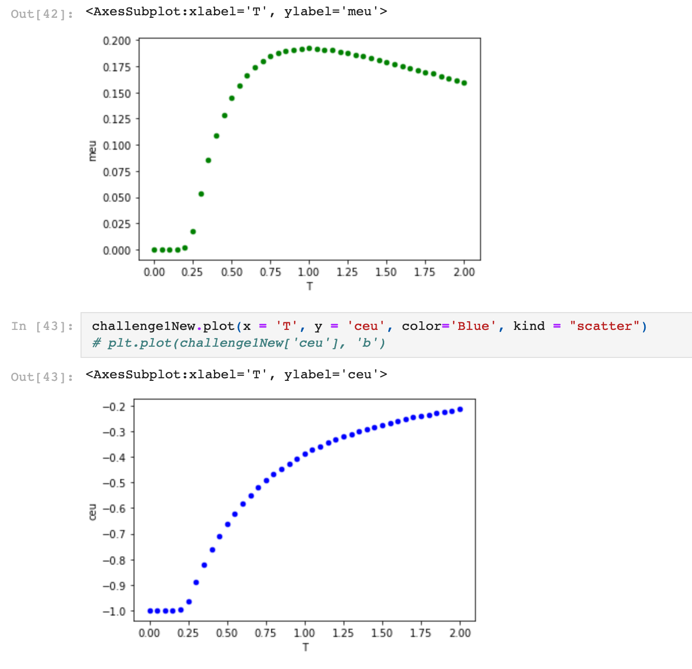
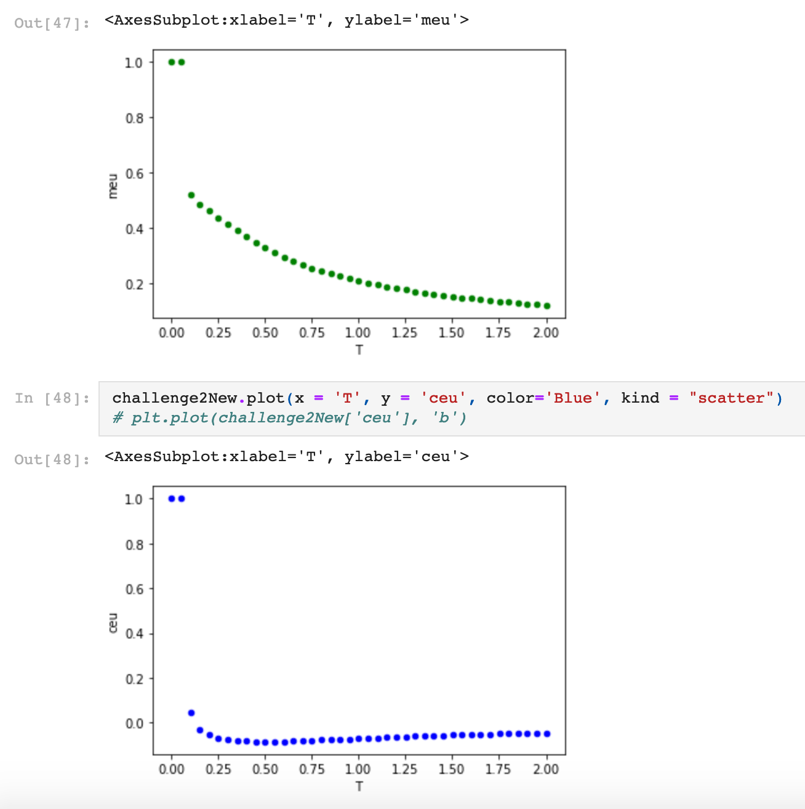
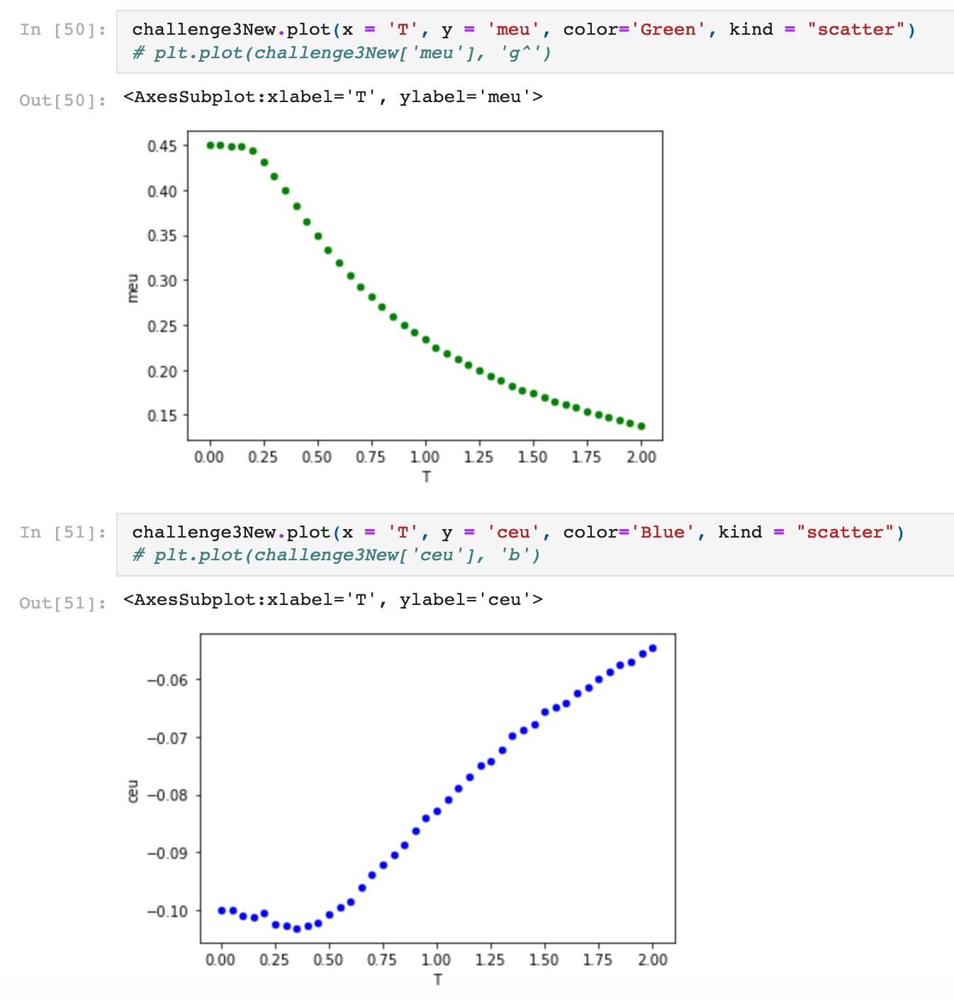

# Metropolis-Algorithm

Numerical Methods Project. 
It takes about 4 minutes to run and see the values for each challenge method. 

Challenge 1:
B = 0.51
C = -0.51

Challenge 2:
B = 0.25
C = -0.12

Challenge 3: 
B = 0.30
C = -0.15

Challenge 4: 
Highest peak for <m> is 0.19233640000000005
  
Challenge 5: 
Lowest Minimum value for <cp> is -0.08388079999999999
  
  
